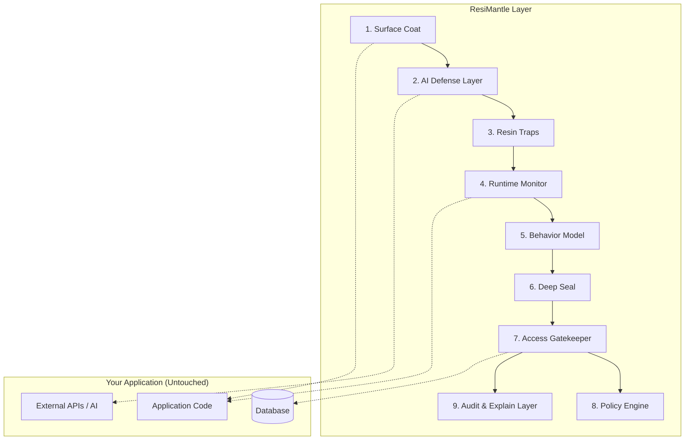

# ResiMantle Architecture

ResiMantle is built on a 9-layer architectural model designed to provide progressive, non-invasive security for modern applications.

This document describes the current implemented foundation. For the expanded target architecture with adaptive deception, false-victory handling, quarantine mode, and a central control plane, see [Control Plane Architecture](./control-plane-architecture.md).

## Layer Description

1. **Surface Coat**: Initial static protection. Checks for exposed secrets, dependency vulnerabilities, and misconfigurations without modifying code.
2. **AI Defense Layer**: Protection against AI-specific attacks like prompt injection and unauthorized tool use.
3. **Resin Traps**: Decoys, canaries, and honeypots designed to detect automated exploration and malicious agents.
4. **Runtime Monitor**: Observes application behavior in real-time.
5. **Behavior Model**: Establishes a baseline of normal operation using the data from the Runtime Monitor.
6. **Deep Seal**: Hardens sensitive zones based on behavioral insights.
7. **Access Gatekeeper**: The decision engine that evaluates requests against policies and the behavior model.
8. **Policy Engine**: Evaluates declarative security rules.
9. **Audit & Explain Layer**: Provides full traceability and human-readable explanations for all decisions made by the system.
