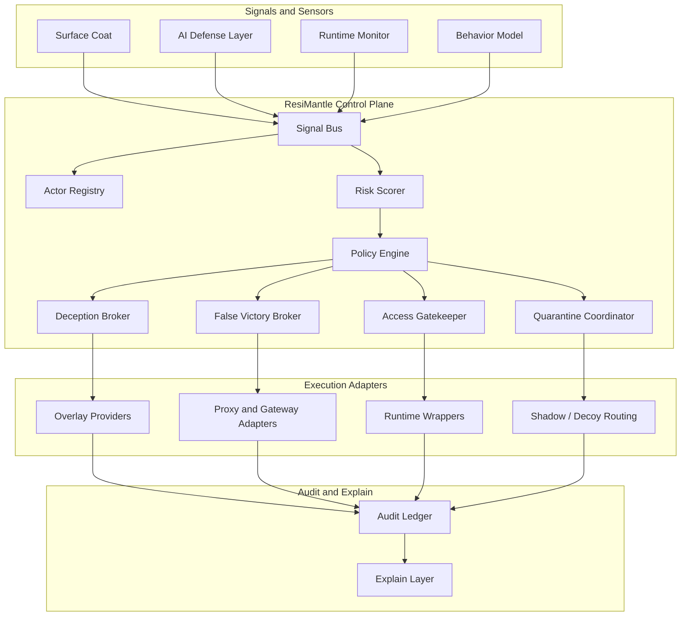

# ResiMantle Control Plane Architecture

This document defines the target architecture for ResiMantle as a zero-touch defensive control plane for AI-era software.

It complements the current [architecture overview](./architecture.md). That overview describes the implemented 9-layer foundation. This document describes the expanded architecture required to support adaptive deception, false-victory handling, session quarantine, and policy-driven runtime control without modifying the protected application's source code.

For the first implementation-focused slice of the deception system, see [Deception Resin + False Victory MVP](./deception-mvp.md).

## Design Goals

ResiMantle must preserve five invariants:

1. **Zero-touch codebase**: never edit the user's source tree.
2. **Policy-first control**: every meaningful defensive action must be externally auditable.
3. **Session-scoped enforcement**: trust, deception, and quarantine decisions apply to actors and sessions, not to the whole application blindly.
4. **Synthetic-only deception**: decoys, false context, and false victories must use synthetic assets, never real user data disguised as bait.
5. **Explainable outcomes**: every allow, limit, deceive, quarantine, or block decision must produce a causal audit trail.

## Architectural Thesis

ResiMantle is not only a scanner or runtime monitor. It is a defensive control plane that governs four things around a protected system:

- what an actor can observe
- what an actor can attempt
- what response an actor receives
- what evidence is produced by that interaction

That control plane should treat offensive reasoning by automated agents as a detection surface. Instead of trying to out-think an adversarial model, ResiMantle narrows the environment the model can inspect, probe, or chain together.

## Topology

The product should be implemented as an event-driven system with a central decision kernel.



## Trust Model

ResiMantle should operate on explicit trust states rather than a binary allow-or-block model.

| State | Meaning | Typical response |
| --- | --- | --- |
| `trusted` | Known internal user, approved system, or strongly authenticated automation | Minimal friction, real surface |
| `observed` | Unknown or weakly identified actor | Full telemetry, no deception yet |
| `suspicious` | Unusual sequence, extraction behavior, or tool abuse indicators | Rate shaping, targeted canaries, tighter evaluation |
| `deceptive` | High-confidence hostile reconnaissance or abuse | Story-bound overlays, synthetic context, false-victory eligibility |
| `restricted` | Dangerous access attempt to a sensitive action | Explicit approvals, narrow allowlists, or denial |
| `quarantined` | Confirmed hostile or policy-violating session | Shadow routing, decoy mode, or hard isolation |

Trust must be evaluated per actor and per session, with time decay and evidence correlation.

## Core Control Plane Components

### Mantle Orchestrator

The orchestrator is the central decision kernel that consumes signals, evaluates policies, maintains trust state, and emits defense actions.

Responsibilities:

- correlate signals into a session timeline
- maintain actor and session state
- compute current trust posture
- request policy evaluation
- select deception and false-victory profiles
- hand off execution to adapters
- attach all decisions to the audit ledger

### Signal Bus

The signal bus is the normalized intake channel for all detections and observations. It decouples layer-specific detection from system-wide decisions.

Every signal should carry:

- actor identity or session reference
- source layer
- timestamp
- severity and confidence
- subject or resource touched
- causal evidence
- correlation keys

### Actor Registry

The actor registry maintains state for humans, agents, API clients, tools, wrappers, and runtime sessions.

It should track:

- identity claims
- channel and entrypoint
- tooling fingerprints
- prior signals and historical trust
- active deception profile
- quarantine status

### Risk Scorer

The risk scorer transforms individual detections into a bounded suspicion score and trust state transition. It must consider sequence, frequency, rarity, and lateral movement attempts, not only isolated events.

### Policy Engine

The policy engine remains the normative authority. It decides what is allowed, limited, redirected, approved, quarantined, or blocked given current context.

Policies should be able to express:

- actor classes and identity requirements
- sensitive resources and operations
- anomaly thresholds
- deception eligibility rules
- false-victory eligibility rules
- quarantine escalation rules
- mandatory explanation requirements

### Deception Broker

The deception broker does not generate random bait. It selects and activates coherent synthetic narratives for suspicious actors.

Responsibilities:

- choose a deception story that matches the real stack shape
- bind synthetic assets to session or actor scope
- project overlays into adapters
- avoid contradictions between files, tools, routes, and docs
- preserve reproducibility for audit and attribution

### False Victory Broker

The false victory broker is responsible for controlled, non-destructive success states for hostile automation.

Responsibilities:

- decide when a suspicious action should appear successful without producing real effect
- ensure the response is syntactically and behaviorally plausible
- prevent any false-victory response from mutating production state
- attach all such responses to audit records and operator explainability

### Quarantine Coordinator

The quarantine coordinator isolates high-risk sessions by moving them to a shadow or decoy path. It should preserve observation while reducing access to the real environment.

## Layer Responsibilities

### 1. Surface Coat

Purpose:

- produce static exposure signals
- map sensitive files, dependencies, endpoints, configs, and secrets
- identify high-value zones that later layers should protect more aggressively

Outputs:

- surface findings
- sensitive asset inventory
- likely deception anchor points

### 2. AI Defense Layer

Purpose:

- detect prompt injection patterns
- detect tool abuse and context-extraction behavior
- classify agent intent at the interaction layer

Outputs:

- prompt-risk signals
- tool-policy violations
- suspicion increments for agent-driven behavior

### 3. Deception Resin Layer

Purpose:

- provide synthetic assets and believable false context to suspicious actors
- make automated reconnaissance expensive and attributable

This layer should evolve the current canaries and decoys into a story-driven system.

Primary concepts:

- **deception stories**: coherent synthetic sub-realities
- **story assets**: fake credentials, endpoints, docs, tables, workers, dashboards, runbooks
- **binding**: session, actor, environment, and time scope
- **trigger hooks**: callbacks when a synthetic asset is touched or reused

### 4. False Victory Layer

Purpose:

- return a believable but non-operative success outcome to suspicious automation

This layer is especially useful when an attacker or agent expects binary feedback and is likely to continue based on that feedback.

Examples of safe false-victory patterns:

- accept a suspicious write request into a shadow sink and return success while committing nothing to production
- acknowledge a tool action as completed when it only affected a synthetic workspace
- return a plausible task identifier that is bound to a decoy execution path

False victory is not deception for everyone. It must be policy-gated, actor-scoped, and audit-heavy.

### 5. Runtime Monitor

Purpose:

- capture runtime events from HTTP, filesystem, process, database, AI calls, and internal tool usage
- turn real execution into structured telemetry for the control plane

Outputs:

- normalized runtime events
- latency and sequence data
- rare path signals

### 6. Behavior Model

Purpose:

- learn a baseline of normal flows over time
- measure rarity, sequence deviation, and cross-surface anomalies

Outputs:

- anomaly scores
- baseline profiles
- sequence-level suspicion signals

### 7. Deep Seal

Purpose:

- progressively harden sensitive zones from the outside as the system gains confidence

Typical controls:

- tighter gatekeeper rules on rare paths
- extra runtime wrappers for admin and secret-handling flows
- increased justification requirements for sensitive tool use

### 8. Access Gatekeeper

Purpose:

- make the final operational decision for sensitive actions

Decision outcomes should include:

- allow
- allow with logging
- allow with rate shaping
- require approval
- redirect to decoy or shadow path
- quarantine
- block

### 9. Policy Engine

Purpose:

- define declarative rules that govern all control-plane decisions

The policy engine must remain external to the protected application and versionable by operators.

### 10. Quarantine / Decoy Mode

Purpose:

- move suspicious sessions into a safer, observable environment where their actions cannot affect production truth

This is not only a block mode. It is a controlled isolation mode that can still collect evidence.

Possible implementations:

- shadow endpoints behind the proxy layer
- decoy filesystems and synthetic read views
- detached queues or no-op sinks
- simulated internal services

### 11. Audit & Explain Layer

Purpose:

- provide complete traceability and human-readable explanations of every meaningful decision

The audit layer should capture:

- raw signals
- correlated incidents
- trust state transitions
- selected stories and overlays
- false-victory responses
- quarantine activations
- policy rules matched
- final operator-facing explanation

## Overlay and Adapter Model

ResiMantle should never patch the user's application source, but it can safely interpose around execution. That requires explicit adapters.

Recommended adapter classes:

- **proxy adapters** for HTTP, AI API calls, and internal service requests
- **runtime wrappers** for monitored command execution and process supervision
- **overlay providers** for search, file reads, generated docs, and tool output shaping
- **shadow routing adapters** for decoy services, quarantine mode, and false-victory sinks

These adapters are where defensive decisions become visible to the actor.

## Data Model and Contracts

The control plane should converge on a small set of shared contracts.

```ts
type TrustState =
  | 'trusted'
  | 'observed'
  | 'suspicious'
  | 'deceptive'
  | 'restricted'
  | 'quarantined';

interface ActorContext {
  actorId: string;
  sessionId: string;
  channel: 'http' | 'cli' | 'tool' | 'ai' | 'runtime';
  trustState: TrustState;
  suspicionScore: number;
  identity?: {
    principal?: string;
    authStrength?: 'weak' | 'medium' | 'strong';
    kind?: 'human' | 'agent' | 'service' | 'unknown';
  };
  activeStoryId?: string;
  quarantineId?: string;
  tags: string[];
}

interface SecuritySignal {
  id: string;
  actorId: string;
  sessionId: string;
  sourceLayer:
    | 'surface-coat'
    | 'ai-defense'
    | 'deception-resin'
    | 'false-victory'
    | 'runtime-monitor'
    | 'behavior-model'
    | 'deep-seal'
    | 'gatekeeper'
    | 'policy-engine';
  type: string;
  severity: 'none' | 'low' | 'medium' | 'high' | 'critical';
  confidence: number;
  resource?: string;
  evidence: Record<string, unknown>;
  timestamp: string;
}

interface DefenseAction {
  id: string;
  actorId: string;
  sessionId: string;
  decision:
    | 'allow'
    | 'log'
    | 'limit'
    | 'approve'
    | 'deceive'
    | 'false-victory'
    | 'quarantine'
    | 'block';
  explanation: string;
  matchedPolicies: string[];
  adapterBindings: string[];
  createdAt: string;
}

interface DeceptionStory {
  id: string;
  name: string;
  stackTags: string[];
  scope: 'session' | 'actor' | 'environment';
  assets: Array<{
    kind: 'credential' | 'endpoint' | 'document' | 'table' | 'queue' | 'service';
    handle: string;
    synthetic: true;
  }>;
  triggers: string[];
}
```

## Decision Flow

The control plane should follow a repeatable pipeline:

1. A layer emits one or more `SecuritySignal` events.
2. The orchestrator correlates them into the current `ActorContext`.
3. The risk scorer proposes a trust-state transition.
4. The policy engine evaluates the action under current context.
5. The orchestrator selects one or more `DefenseAction` outcomes.
6. Adapters apply the decision through gating, overlays, false victory, or quarantine.
7. The audit ledger persists the entire causal chain.
8. The explain layer renders a human-readable explanation.

## Safety Boundaries

ResiMantle must avoid crossing from defensive deception into unsafe or offensive behavior.

Forbidden behaviors:

- editing customer source code or silently patching logic
- reusing real secrets or private records as bait
- allowing synthetic assets to reach production side effects
- harming, retaliating against, or exfiltrating from the actor
- making the real system unusable for trusted operators

Required safeguards:

- bypasses for trusted operators and approved automation
- per-story provenance and synthetic-asset tracking
- deterministic audit records for every deception or false-victory decision
- hard separation between production paths and shadow or decoy paths

## Mapping to the Current Repository

The current repository already contains the right seeds for this architecture.

| Existing component | Current role | Target role |
| --- | --- | --- |
| `ResiMantleEngine` | top-level orchestrator for scan, policy, traps, and reports | evolve into a composition root for the control plane |
| `SurfaceCoatScanner` | static scan entrypoint | surface signal producer and sensitive-asset mapper |
| `AiProxy` / prompt shield | prompt and tool protection | agent-intent and tool-abuse signal source |
| `CanaryManager` | generates and checks trap tokens | synthetic asset registry with story bindings |
| `DecoyGenerator` | static decoy endpoint generator | story-driven deception asset synthesizer |
| `PromptCanary` | prompt watermarking | session-bound attribution watermarking |
| `RuntimeMonitor` | emits runtime events | normalized telemetry producer for the control plane |
| `BehaviorModel` | anomaly and baseline support | trust-state input for adaptive control |
| `Gatekeeper` | access decision point | final operational enforcement adapter |
| `PolicyEngine` | declarative rules | normative decision authority |
| `Audit` / `Reporter` | logging and reports | full evidence ledger and explain output |

## Suggested Implementation Phases

### Phase 1: Control Plane Foundation

- introduce shared contracts for actor context, signals, decisions, and stories
- add a signal bus abstraction and trust-state model
- refactor the engine into a composition root that wires layers together

### Phase 2: Story-Driven Deception

- evolve canaries and decoys into session-bound story assets
- add the deception broker and overlay provider abstraction
- tie prompt canaries to actor and session attribution

### Phase 3: False Victory and Shadow Routing

- add a false-victory broker with strict safety rails
- implement shadow sinks and decoy routing adapters
- connect quarantine mode to policy outcomes

### Phase 4: Adaptive Runtime Control

- feed runtime monitor and behavior model signals into trust-state transitions
- tighten deep-seal rules around sensitive paths
- connect gatekeeper decisions to actor trust and session state

### Phase 5: Explainability and Operator UX

- produce timelines and decision graphs for sessions
- explain why an actor saw a specific overlay or false success state
- distinguish current truth, synthetic truth, and blocked truth clearly in reports

## Summary

ResiMantle should evolve from a layered defensive toolkit into a zero-touch defensive control plane.

Its strategic advantage is not only runtime visibility. It is the ability to govern what suspicious actors can observe, what they can attempt, what responses they receive, and how those interactions become evidence, all without modifying the protected source code.